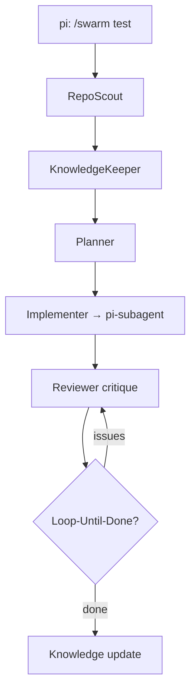

# Agent Swarm System

A lightweight multi-agent swarm built on top of **pi** + **Absurd**.

## Philosophy

- Keep agents narrow and focused
- Use Absurd mainly for durability and shared state
- Avoid heavy, rigid workflow scaffolding
- Make the Knowledge Keeper the core long-term value

This system follows the idea of "a harness for every task" — small, composable agents instead of one monolithic agent.

## Requirements

- **pi** — https://github.com/earendil-works/pi-coding-agent
- **Absurd** — https://github.com/earendil-works/absurd (durable execution engine)

## Current Agents

| Agent            | Responsibility                              | Status     |
|------------------|---------------------------------------------|------------|
| Repo Scout       | Discover and analyze projects via Mercator  | Working    |
| Knowledge Keeper | Extract how you code, architect, and work   | Core       |
| Planner          | Create lightweight implementation plans     | Working    |
| Reviewer         | Adversarial verification of outputs         | Working    |
| Implementer      | Executes actual work (code, tests, etc.)    | Working    |
| (Workflow)     | improve-auth-across-projects (full chain)   | Complete   |

## Available Commands (in pi)

| Command                    | Description                              |
|---------------------------|------------------------------------------|
| `/swarm test`             | Run basic Scout → Knowledge Keeper flow          |
| `/swarm worker`           | Start an Absurd worker                           |
| `/swarm status <task-id>` | Check status of a task                           |
| `/swarm list`             | List recent tasks                                |
| `/swarm cancel <task-id>` | Cancel a running or pending task                 |
| `/swarm knowledge`        | Show the current persistent knowledge base       |

## Workflow Patterns (Implemented)

All 6 patterns from "A Harness for Every Task":

- **Classify-and-Act** — route by type (via Planner/Scout)
- **Fanout-and-Synthesize** — parallel agents + merge (full impl below)
- **Adversarial Verification** — `reviewer` (real critique: length, plan gaps, placeholders)
- **Generate-and-Filter** — options + selection
- **Tournament** — pairwise judging
- **Loop-Until-Done** — agent-based iteration (reviewer checks) until clean

## Agent I/O Examples

- **Repo Scout**: in `{repoPath}` → out `{files, structure, issues}`
- **Planner**: in `{task, context}` → out `{steps[], risks[]}`
- **Reviewer**: in `{originalOutput, context}` → out `{issuesFound[], suggestions[], overallAssessment, feedback}`
- **Implementer**: in `{task, plan?, executor?}` → out `{handoff, executorUsed}` (pi-subagent real delegation supported)
- **Knowledge Keeper**: in `{observation}` → persists to store

## Declarative Workflows (YAML)

Early support for defining workflows in YAML:

```yaml
name: improve-auth
steps:
  - scout
  - knowledge-keeper
  - planner:
      model: claude-3.5-sonnet
  - implementer:
      model: grok-4.3
      executor: pi-subagent
```

## Example Workflow (Mermaid)



## Architecture

See `ARCHITECTURE.md` for the current design principles.

The system now includes a **Model Routing Layer** (`models/`) that allows assigning different models (Claude, Grok, etc.) to agents based on abstract capabilities (`reasoning`, `coding`, `fast`, etc.).

## Installation as a Skill

Copy or symlink this folder to:

```
~/.pi/agent/skills/swarm/
```

Then reload pi. The swarm system will be available via the `/swarm` commands.

## Dashboard (Habitat)

Absurd comes with an official dashboard called **Habitat**.

Install it from the Absurd releases, then run:

```bash
habitat run -db-name absurd2
```

Open http://localhost:7890 to see running tasks, queues, and history.

This is very useful when working with long-running or background swarm workflows.

## Quickstart + Examples

```bash
# 1. Basic end-to-end (scout + knowledge)
/swarm test

# 2. Full auth improvement across projects (end-to-end example)
# (run with worker active)

# 3. Status / control
/swarm status <id>
/swarm list
/swarm cancel <id>
/swarm knowledge

# 4. Habitat dashboard (recommended for long workflows)
habitat run -db-name absurd2  # open http://localhost:7890
```

See `docs/WORKFLOWS.md` for the complete declarative description.
See `docs/CHEATSHEET.md` for the simple, copy-paste prompts you can actually type into pi right now.

**Real example run:**
```bash
cd ~/.pi/agent/swarm
npx tsx examples/run-auth-improvement.ts
```
Then start a worker (`/swarm worker`) and monitor via Habitat.

## Additional Documentation

- `AGENTS.md` — Guide for developing new agents and workflows
- `TODO.md` — Current backlog and future work

## Status

This is an evolving system. The goal is to create reusable, durable, and improving agent workflows without over-engineering.
