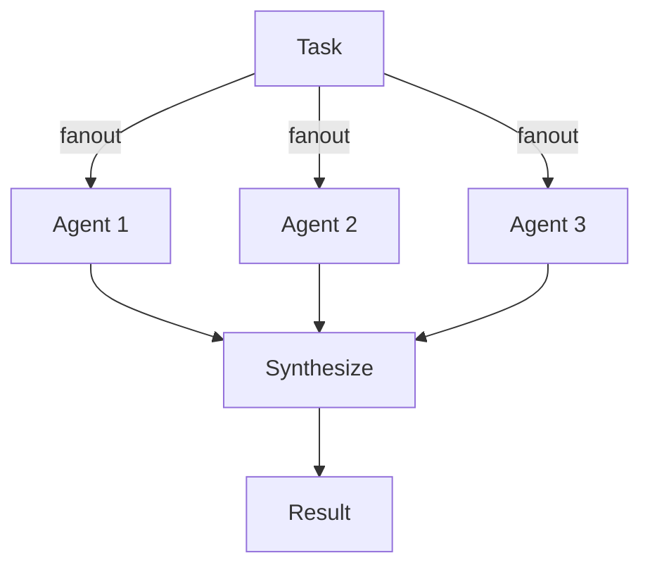
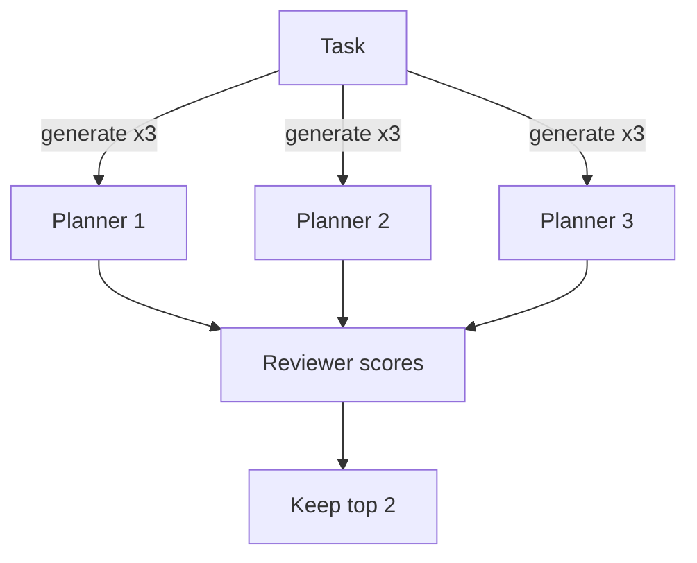
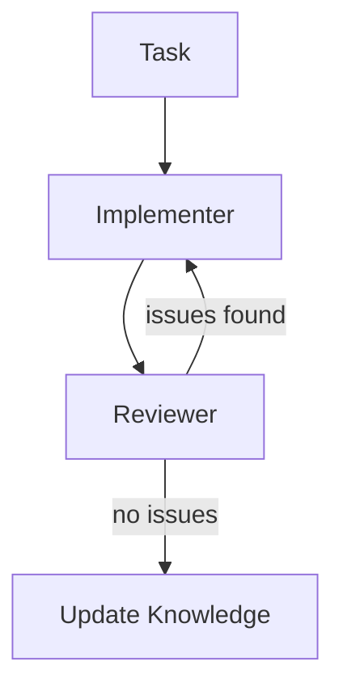

# Swarm Workflow Patterns (Declarative View)

This document describes the swarm's behavior **purely in documentation** — no TypeScript implementation details.

## Core Philosophy

- Agents are narrow specialists
- Workflows are composable patterns, not rigid engines
- Absurd provides durability and shared state only
- pi acts as the flexible orchestrator and control surface

---

## The 6 Workflow Patterns

### 1. Classify-and-Act
Route incoming work by type, then dispatch to the appropriate specialist.

**Example flow:** Repo Scout classifies project → Knowledge Keeper extracts patterns → Planner creates plan.

### 2. Fanout-and-Synthesize
Run several agents in parallel on the same task, then merge their outputs.

**Mermaid:**


**Real usage:** `fanout-and-synthesize` task with configurable `agents[]` list.

### 3. Adversarial Verification (Reviewer)
One agent produces output; Reviewer challenges it for gaps, assumptions, and improvements.

**Reviewer contract (pure spec):**
- Input: `{ originalOutput, context? }`
- Output: `{ issuesFound[], suggestions[], overallAssessment, feedback }`
- Real critique rules: length checks, missing plans, placeholder detection

### 4. Generate-and-Filter
Produce multiple candidate solutions, then score and keep the best.

**Mermaid:**


**Real usage:** `generate-and-filter` with parallel planner spawns + reviewer rubric.

### 5. Tournament
Generate candidates and run pairwise comparisons until a clear winner emerges.

**Flow:** Multiple planners → head-to-head reviewer judgments → single winner.

### 6. Loop-Until-Done
Iterate while issues remain, using an agent (Reviewer) as the stopping condition.

**Mermaid:**


**Stopping condition:** Reviewer returns zero issues or max iterations reached.

---

## End-to-End Example: improve-auth-across-projects

**Goal:** Improve authentication patterns across all discovered projects.

### High-Level Flow (Mermaid)

```mermaid
sequenceDiagram
  participant Pi as pi (/swarm)
  participant Scout as Repo Scout
  participant Keeper as Knowledge Keeper
  participant Planner as Planner
  participant Impl as Implementer
  participant Rev as Reviewer
  participant Loop as Loop-Until-Done

  Pi->>Scout: Discover projects
  Scout->>Keeper: Extract patterns
  Keeper->>Planner: Build plan
  Planner->>Impl: Execute (pi-subagent handoff + retry)
  Impl->>Rev: Critique output
  Rev->>Loop: Check for issues
  Loop-->>Rev: Iterate if needed
  Loop->>Keeper: Persist new knowledge
```

### Step-by-Step Contract

| Step | Agent          | Input                              | Output                              | Success Criteria                  |
|------|----------------|------------------------------------|-------------------------------------|-----------------------------------|
| 1    | Repo Scout     | `requestId`                        | `projects[]`                        | At least 1 project discovered     |
| 2    | Knowledge Keeper | `projects[]`                     | Updated `KnowledgeBase`             | Patterns extracted & merged       |
| 3    | Planner        | `projects`, `knowledge`            | `steps[]`, `risks[]`                | Actionable plan with risks        |
| 4    | Implementer    | `task`, `plan?`, `executor`        | `handoff` + `executorUsed`          | Real delegation attempted (retry on failure) |
| 5    | Reviewer       | Implementer output                 | `issuesFound[]`, `overallAssessment`| Issues list or "Solid"            |
| 6    | Loop-Until-Done| Reviewer feedback                  | Final state or max iterations       | Zero issues or max reached        |

### Expected Artifacts
- Persistent knowledge updated in store
- Handoff record for every Implementer call (with executor and attempt count)
- Habitat shows full task tree with checkpoints

---

## Running the Example (Non-Code)

1. Start worker: `/swarm worker`
2. Launch example: `npx tsx examples/run-auth-improvement.ts`
3. Monitor: open Habitat at http://localhost:7890
4. Inspect knowledge: `/swarm knowledge`

All behavior above is defined by the contracts in this document. The TypeScript files are one possible implementation of these contracts.